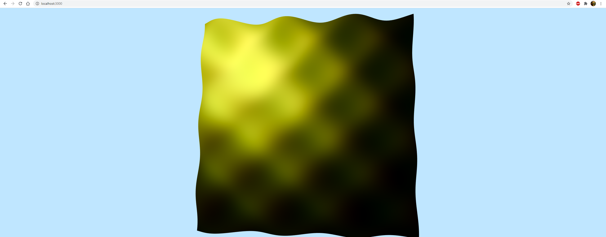

# Lab3-WebGl

3 лабораторная по компьютерной графике.
Для поворота поверхности используются клавиши W,A,S,D,Q,E
Это та же вторая лабораторная, но с добавлением освещения. Также тут используются матрицы MVP (модель, представление, перспектива)

